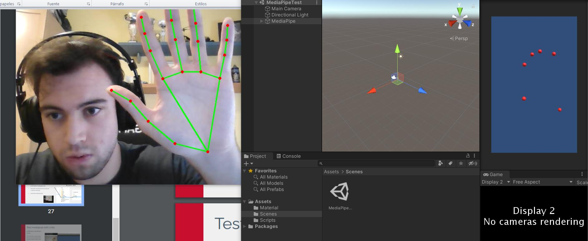

# S.I-2021-NIA206116

## Lab1: Roll-A-BALL
### Description: The environment is a soccer field, with 2 teams, 11 players each, you are the ball and you can score to whatever team. Try to avoid players.
### Objective: Collect the 12 collectionables and score a goal to win. 

## Lab2: HayMachine
### Description: Hit hay to sheeps with space, to control machine use <- ->.
### Objective: Shoot to 10 sheeps to win, lose if 3 are not shooted. 

## Lab5: ExternalSensors

